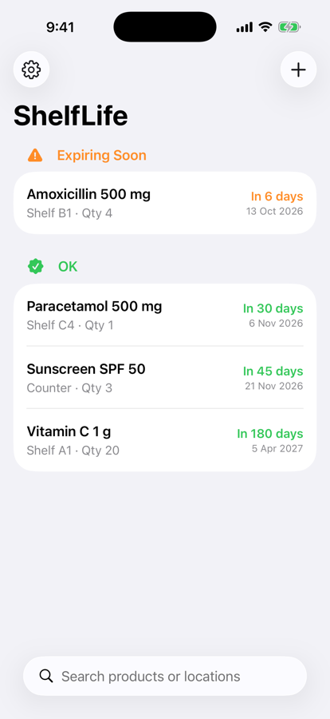
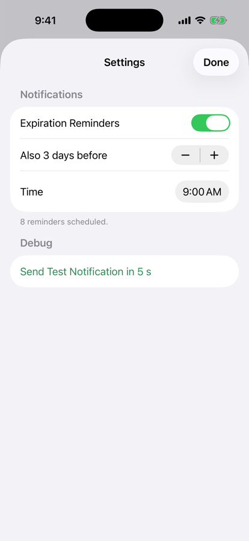
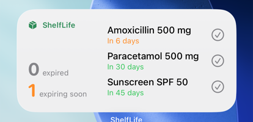

# ShelfLife

A native iOS app for tracking product expiration dates, built with SwiftUI and SwiftData. It is offline-first and deeply integrated with the system: home and lock screen widgets, local notifications, Siri and Shortcuts, and barcode scanning.

<p>
  
  
</p>


## Features

- **Expiration tracking.** Products are grouped into *Expired*, *Expiring Soon* (7 days or less) and *OK*, with search by name or location.
- **Reminders.** Local notifications N days before and on the expiration day, at a time you choose. Reminders are rescheduled automatically within iOS's limit of 64 pending notifications.
- **Widgets.** Small, medium and lock screen widgets. The medium widget is interactive: tapping ✓ removes a product without opening the app.
- **Siri and Shortcuts.** *"What expires soon in ShelfLife"* answers with a spoken summary and a visual snippet. *"Remove ‹product› from ShelfLife"* is also available. Both work with no setup.
- **Barcode scanning.** Scan live with the camera (VisionKit) or pick a photo (Vision). Scanning a product you entered before fills in its name and location, which suits restocking the same product with a new batch.

## Tech stack

Swift 6 (strict concurrency) · SwiftUI · SwiftData · WidgetKit · App Intents · UserNotifications · VisionKit · Vision · PhotosUI · Swift Testing · XcodeGen

Requires iOS 26 or later.

## Architecture

The app and its widget extension run as separate processes. They share one SwiftData store located in an **App Group** container:

```
App ──► SwiftData ◄── Widget extension
 │        (App Group)        ▲
 └─ ProductSync: save → reload widget timelines → reschedule reminders → update Siri phrases
```

Every layer follows the same rule: **pure logic decides, and thin adapters talk to iOS.**

| Pure, unit-tested logic | System adapter |
|---|---|
| `ExpirationStatus`: days remaining → status | SwiftUI views |
| `ReminderPlanner`: which reminders to schedule, capped at 64 | `ReminderScheduler`: diffs them against pending requests |
| `ExpiringSoonIntent.summary`: what Siri says | `AppShortcutsProvider` |
| `BarcodeImageReader`: barcode found in an image | `LiveBarcodeScanner` (`UIViewControllerRepresentable`) |

### Project structure

```
ShelfLife/
├── project.yml              # XcodeGen spec: app, widget and test targets
├── Shared/                  # Compiled into both the app and the widget
│   ├── SharedModelContainer.swift
│   ├── Models/              # Product (@Model), ExpirationStatus
│   └── Intents/             # ProductEntity, RemoveProductIntent
├── ShelfLife/               # App target
│   ├── App/                 # @main entry point, AppDelegate (notification delegate)
│   ├── Features/
│   │   ├── ProductList/
│   │   ├── ProductForm/
│   │   ├── Reminders/       # Settings, planner, scheduler
│   │   └── Scanner/
│   ├── Intents/             # ExpiringSoonIntent, App Shortcuts
│   └── Services/            # ProductSync
├── ShelfLifeWidget/         # WidgetKit extension
└── ShelfLifeTests/          # Swift Testing
```

## Notable problems solved

- **SwiftData migration trap.** Adding `var uuid = UUID()` to an existing model gave every migrated row the *same* UUID, because the default value is evaluated once. Unique IDs are needed for notification identifiers.
- **Notification race.** `removeAllPendingNotificationRequests()` runs asynchronously inside iOS and could delete requests added right after it. Scheduling now diffs the new reminders against the pending requests and cancels any reschedule that is still in flight.
- **Interactive widget intents.** Running an entity-typed intent in the widget process requires the system to resolve the entity. Widget buttons use an ID-based intent instead.

## Running

```bash
brew install xcodegen
xcodegen generate
open ShelfLife.xcodeproj
```

Choose an iPhone simulator and press ⌘R. Add the `-seed-sample-data` launch argument to start with demo products. Run the tests with ⌘U.

> The camera scanner needs a real device. In the simulator, use **Choose Photo**.
